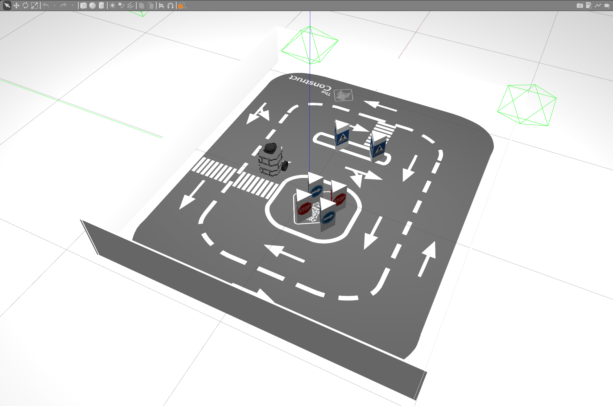

# ROS Basics - Course Project
Real Robot Project using Turtlebot3 from course "ROS Basic in 5 Days" by The Construct

## Overview
This project aim to apply the knowledge acquired in the "ROS Basics in 5 Days" course using both simulation and a real robot. It involves practicing with a Turtlebot3 robot which is stationed in Barcelona, Spain. 
The course project is structured to be completed remotely, enabling hands-on learning with real-world applications.


## Project Structure
The course project is divided into three main parts, each focusing on core ROS functionalities:
- **Part I**: Focus on topic publishers and subscribers.
- **Part II**: ROS services.
- **Part III**: ROS actions.

## Simulation
Before implementing solutions on the real robot, students should first utilize the provided simulation environment. This allows for thorough testing and refinement of code in a controlled setting, ensuring robustness before live deployment.

## Getting Started
1. **Launch the Simulation**: Begin by launching the simulation environment

The simulation environment for the real robot lab can be obtain from [Real Robot Lab Simulation](https://bitbucket.org/theconstructcore/realrobotlab_simulation/src/master/) 

2. **Progress Through the Parts**: Navigate through each part of the project 

## launch file
```bash
roslaunch turtlebot3_move main.launch
```

## action server
```bash
rosrun turtlebot3_move turtlebot3_move_server.py 
```

## action client
```bash
rosrun turtlebot3_move turtlebot3_move_client.py 
```

3. **Apply and Test on the Real Robot**: After successful simulation tests, apply to the real Turtlebot3 robot.

